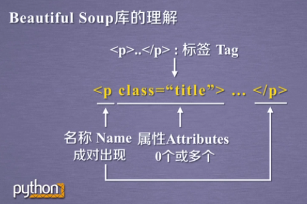
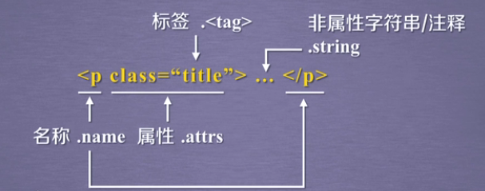
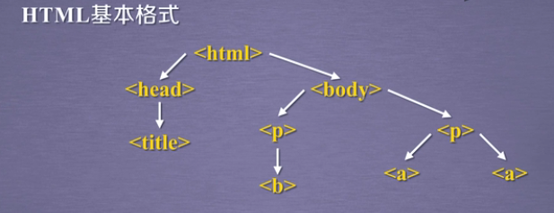

# beautifulsoup 安装和使用

'''
pip install beautifulsoup4

from bs4 import BeautifulSoup

soup = BeautifulSoup('
data
','html.parser')
'''

# bs库的基本元素

html文档 == 标签树 == beautifulsoup类

beautifulsoup库解析器

解析器|使用方法|条件
-|-|-
BS4的html解析器|BeautifulSoup(mk,'html.parser')|安装bs4库
lxml的html解析器|BeautifulSoup(mk,'lxml')|pip install lxml
lxml的xml解析器|BeautifulSoup(mk,'xml')|pip install lxml
html5lib的解析器|BeautifulSoup(mk,'html5lib')|pip install html5lib

基本元素|说明
-|-
Tag|标签，最基本的信息组织单元，以<>，</>表明开头和结尾
Name|标签的名字，
...
的名字是‘p',格式：<tag>.name
Attributes|标签的属性，字典形式，格式：<tag>.attrs
NavigableString|标签内非属性字符串，<>...</>中的字符串，格式：<tag>.string
Comment|标签内的字符串注释部分

# 标签树的遍历

## 标签树的上行遍历

属性|说明
-|-
.parent|节点的父亲标签
.parents|节点的先辈标签的迭代类型，用于循环遍历先辈节点

**迭代类型只能用在for...in...循环语句中**

## 标签树的下行遍历

属性|说明
-|-
.contents|子节点的列表，将<tag>所有儿子节点存入列表
.children|子节点的迭代类型，用于循环遍历儿子节点
.descendants|子孙节点的迭代类型，用于循环遍历所有子孙节点

## 标签树的平行遍历

属性|说明
-|-
.next_sibling|返回按照html文本顺序的下一个平行节点标签
.previous_sibling|返回按照html文本顺序的上一个平行节点标签
.next_siblings|迭代类型，返回按照html文本顺序的后续所有平行节点标签
.pervious_siblings|迭代类型，返回按照html文本顺序的前续所有平行节点标签

**平行遍历必须发生在同一个父节点下**

# HTML格式化和编码

prettify() 格式化

编码：utf-8

